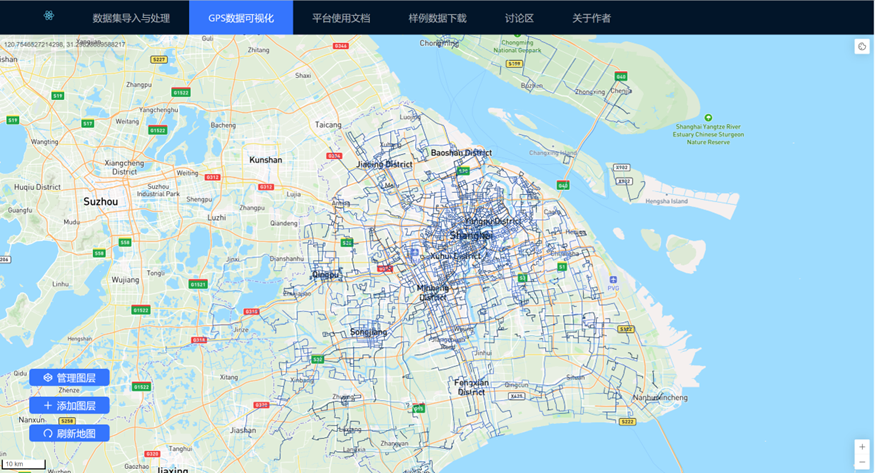
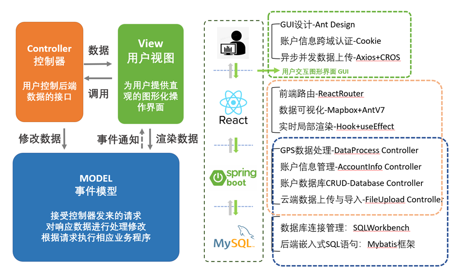
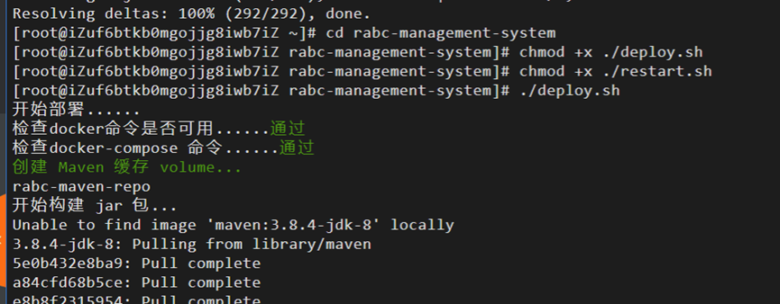
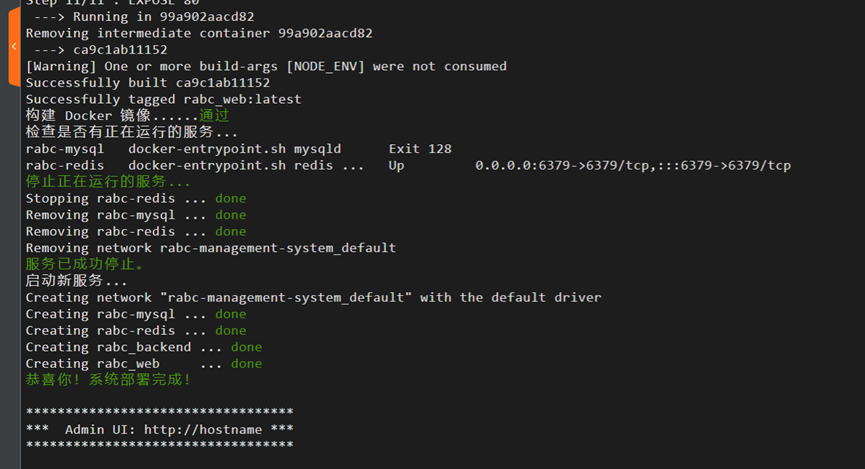
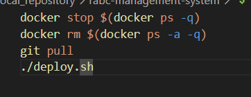

# 基于 WebGIS 的道路交通 GPS 数据分析平台设计与实现

## 介绍

项目利用 WebGIS（网页地理信息系统）相关组件和 API，构建了一个集成交通数据处理和 GPS 数据可视化功能的网页地理信息系统平台，以图形化、响应式的页面为交通研究提供基础的数据处理服务。

平台实现了多种功能，包括用户账户信息管理、用户数据库上传与处理、基于交互式图层编辑的数据可视化分析、车辆轨迹报告等。平台提供平台使用文档和样本数据参考等模块，方便交流学习。平台设计合理、易于使用，从交通数据分析中的具体问题出发，考虑交通数据分析中实际需求，为交通研究提供了有价值的参考和支持。

## 技术路线

项目整体采用前后端分离式开发的设计思想。网页前端设计部分包括对前端路由、数据双向绑定、函数组件全局状态管理、可视化分析图层管理、异步网络请求、账户信息认证与操作权限管理等前端核心功能的实现，并通过后端解析 token 进行用户的权限管理、无感刷新等功能。

网页后端设计部分包括后端用户数据库设计、后端接口设计与开发、权限管理与请求拦截等，实现了用户数据库交互、账户信息数据接口等后端功能。后端使用 redis 和 RabbitMQ 等中间件优化系统在高并发场景下的性能。

## 使用说明

### 使用 Docker 进行部署

- #### 在已安装 Docker 的 linux 系统（测试环境为 Ubantu 20.04.4）中讲仓库克隆到本地
- #### 添加脚本文件执行权限并运行 deploy.sh 脚本
  
- #### 部署成功
  
- #### 重启脚本 restart.sh
- 更新项目并提交至远程仓库后，执行重启脚本克自动关停当前运行中的 container，根据更新后的代码重新生成镜像并启动新容器
  
